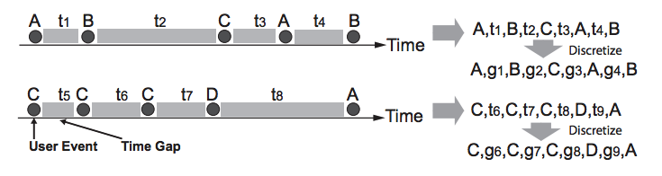
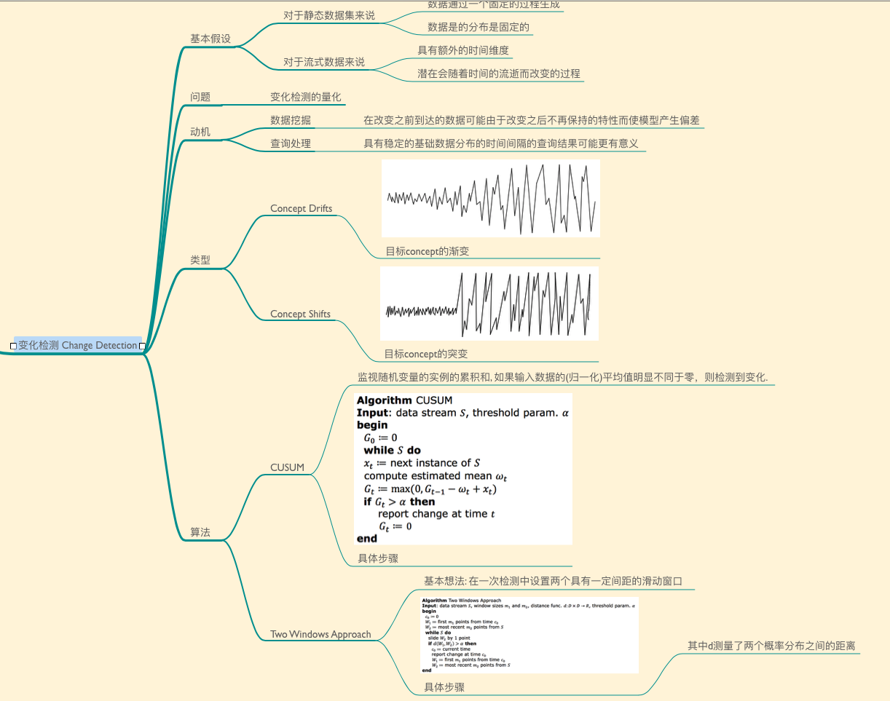
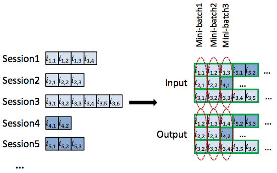
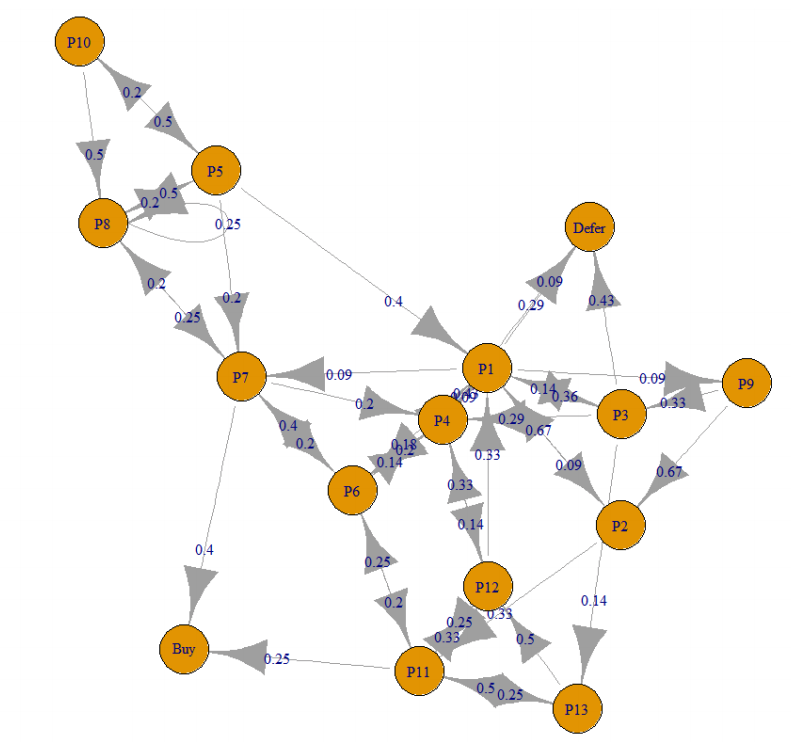

# (Maybe) Useful literatures

## Readings 10.07.2018

- [x] Bi, X., Azenkot, S., Partridge, K., & Zhai, S. (2013, April). Octopus: evaluating touchscreen keyboard correction and recognition algorithms via. In Proceedings of the SIGCHI Conference on Human Factors in Computing Systems (pp. 543-552). ACM. https://static.googleusercontent.com/media/research.google.com/zh-CN//pubs/archive/41646.pdf

- [x] Oulasvirta, A. (2017). User interface design with combinatorial optimization. Computer, 50(1), 40-47. http://users.comnet.aalto.fi/oulasvir/pubs/UIdesign_with_combinatorial_optimization_IEEEComputer_2017_Oulasvirta.pdf

- [x] Goguey, A., Casiez, G., Cockburn, A., & Gutwin, C. (2018, April). Storyboard-Based Empirical Modeling of Touch Interface Performance. In Proceedings of the 2018 CHI Conference on Human Factors in Computing Systems (p. 445). ACM. https://hal.archives-ouvertes.fr/hal-01714825/document

- [x] Yang, Q., Zimmerman, J., Steinfeld, A., & Tomasic, A. (2016, June). Planning adaptive mobile experiences when wireframing. In Proceedings of the 2016 ACM Conference on Designing Interactive Systems (pp. 565-576). ACM. https://www.researchgate.net/profile/Qian_Yang29/publication/302352981_Planning_Adaptive_Mobile_Experiences_When_Wireframing/links/59f13b7c458515bfd07fbb12/Planning-Adaptive-Mobile-Experiences-When-Wireframing.pdf

- [x] Gunning, D. (2017). Explainable artificial intelligence (xai). Defense Advanced Research Projects Agency (DARPA), nd Web. http://explainablesystems.comp.nus.edu.sg/wp-content/uploads/2018/03/XAI%20for%20IUI%202018.pdf

## Readings 28.08.2018

### Seq2Seq Learning

- ***** Dai, A. M., & Le, Q. V. (2015). Semi-supervised sequence learning. In Advances in neural information processing systems (pp. 3079-3087). https://arxiv.org/abs/1511.01432

- Training a Deep Learning Language Model Using Keras and Tensorflow https://github.com/IBM/deep-learning-language-model/blob/master/README.md

- Language Model on One Billion Word Benchmark https://github.com/tensorflow/models/tree/master/research/lm_1b

### User Behavior via Clickstream

- Gündüz, Ş., & Özsu, M. T. (2003, August). A web page prediction model based on click-stream tree representation of user behavior. In Proceedings of the ninth ACM SIGKDD international conference on Knowledge discovery and data mining (pp. 535-540). ACM. http://citeseerx.ist.psu.edu/viewdoc/download?doi=10.1.1.3.1067&rep=rep1&type=pdf

  + Task: Cluster user sessions based on their pair-wise similarity and represent the resulting clusters by a click-stream tree.
  + Dataset:
    + Server log files
    + NASA Kennedy Space Center Log. http://ita.ee.lbl.gov/html/contrib/NASA-HTTP.html.
    + ClarkNet WWW Server Log. http://ita.ee.lbl.gov/html/contrib/ClarkNetHTTP.html
  + Model: alignment score component & local similarity component. The problem of clustering user sessions is formulated as partitioning the graph G into k disjoint subgraphs Gm, (m ∈ [1, ..., k]) by minimizing MinMaxCut function
    + Chris Ding, Xiaofeng He, Hongyuan Zha, Minh Gu, and Horst Simon. Spectral min-max cut for graph partitioning and data clustering. 2001. Technical Report TR-2001-XX, Lawrence Berkeley National Laboratory, University of CaliforniaBerkeley, CA.
  + Experiment:
    + Hit-Ratio: A hit is declared if any one of the three **recommended pages** is the next request of the user. The hit-ratio is the number of hits divided by the total number of recommendations made by the system.
    + Click-Soon-Ratio: A Click-Soon is declared if any one of the three recommended pages is requested by the user during the active user session. The Click-Soon-Ratio is the number of click-soon divided by the total number of recommendations made by the system.
  + Result:
    +  high click-soon-ratio, in some cases even about 100%. Thus, the model is very useful for a cache prefetching system.

- ********** Gang Wang, Xinyi Zhang, Shiliang Tang, Christo Wilson, Haitao Zheng, and Ben Y. Zhao. 2017. **Clickstream User Behavior Models**. ACM Trans. Web 11, 4, Article 21 (July 2017), 37 pages. https://www.researchgate.net/profile/Gang_Wang83/publication/318691579_Clickstream_User_Behavior_Models/links/59ef57820f7e9b97a6d9cd03/Clickstream-User-Behavior-Models.pdf https://www.usenix.org/sites/default/files/conference/protected-files/gang_sec13_slides.pdf

  + Task: On one hand, service providers cannot eectively prevent attackers from creating large numbers of fake identities to disseminate unwanted content (e.g., spam). On the other hand, abusive behavior from real users also poses signicant threats (e.g., cyberbullying)
    + Detection: to capture distinct user groups for the detection of malicious accounts.
    + Understanding: to extract semantic information from user groups to understand the captured behavior
    + Identify unexpected user behaviors and even predict users’ future actions
  + Dataset:
    + using ground-truth clickstream traces of 16,000 real and Sybil users from Renren, a large Chinese social network
    + clickstream data from Renren in collaboration with Renren’s Security team
    + clickstream data from Whisper in collaboration with Whisper’s Data Science team
  + Model: 
    + semi-supervised system to detect malicious user accounts (Sybils): similarity graph where each node is a user and an edge captures the similarity of two users’ clickstreams
    + unsupervised system that aims to capture and understand the fine-grained user behavior

    + Sybil Detection: SVM
    + Features
        + Session Length and Frequency
        + Click Transitions
    + Clickstream Models
        + Click Sequence Model: Sybils and normal users exhibit dierent click transition patterns and focus their energy on dierent activities
        + Time-based Model: each user’s clickstream is represented by a list of inter-arrival times [t1,t2,t3, ...,tn] where n is the number of clicks in a user’s clickstream
        + Hybrid Model: Each user’s clickstream is represented as an in-order sequence of clicks along with inter-event gaps between clicks  [A,t1, B,t2,C,t3,A,t4, B] where A, B,C are click types, and ti is the time interval between the ith and (i + 1)th event
        + 
        + Computing Sequence Similarity:
            + Common Subsequences
            + Common Subsequences With Counts
            + Distribution-based Method
    + Incremental Detection
        + K Nearest Neighbor
        + Nearest Cluster
        + Nearest Cluster-Center closeness centrality
  + Experiment:
    + positive feedback from our industrial collaborators
    + SVM: classication accuracy was 98.9%, with 0.8% false positives (i.e., classify normal users as Sybils) and 0.13% false negatives (i.e., classify Sybils as normal users).
  + Result:
    + propose a coloring scheme to identify groups of malicious accounts without relying on a large labeled dataset
    + model identies the natural groups of user behavior and automatically extracts features to interpret their semantic meanings
    + Evaluation shows that the Click Sequence and Hybrid models perform best at disambiguating Sybils and normal users. 10gram+count and 5gram+count are the best distance functions for each model, respectively

- ********** Gang Wang, Xinyi Zhang, Shiliang Tang, Haitao Zheng, and Ben Y. Zhao. 2016. **Unsupervised Clickstream Clustering for User Behavior Analysis**. In Proceedings of the 2016 CHI Conference on Human Factors in Computing Systems (CHI '16). ACM, New York, NY, USA, 225-236. https://dl.acm.org/citation.cfm?id=2858107

  + Task: 
    + an unsupervised system to capture dominating user behaviors from clickstream data 
    + identifies “clusters” of similar users by partitioning a similarity graph
  + Dataset:
    + Same above
  + Model:
    + Clickstream and Similarity Graph
    + Iterative Feature Pruning & Clustering
    + Divide cluster by cluster
  + Experiment:
  + Result:
    + our algorithm is highly accurate with a precision of 93% and a recall of 94% (1% ground-truth as seed). Using more seeds (e.g. 5%) produces a higher recall (99%) but reduces precision (82%).

- Jihyun Park, Kameryn Denaro, Fernando Rodriguez, Padhraic Smyth, and Mark Warschauer. 2017. Detecting changes in student behavior from clickstream data. In Proceedings of the Seventh International Learning Analytics & Knowledge Conference (LAK '17). ACM, New York, NY, USA, 21-30. https://dl.acm.org/citation.cfm?id=3027430 https://www.youtube.com/watch?v=fc28RYVXi44

  + Task:
    + insights about student activities in an online learning environment and how these activities inform their learning outcomes
  + Dataset:
    + University data
  + Model:
    + statistical change detection techniques
  + Experiment:
  + Result:
  + 

### Web Graph Clustering

- Mandalay, M. WEB GRAPH CLUSTERING USING HYPERLINK STRUCTURE. https://pdfs.semanticscholar.org/e01c/2682268e8ff0ef1d6848e724f8dfd1a75ea2.pdf

  + Task:
    + Hyperlink structure clustering
  + Dataset:
    + Nginx file
  + Model:
    + Normalized Cut (N-Cut): Engine decomposition
    + https://www.youtube.com/watch?v=DmJCM5FRWaM
  + Experiment:
  + Result:

- ***** Page, L., Brin, S., Motwani, R., & Winograd, T. (1999). The PageRank citation ranking: Bringing order to the web. Stanford InfoLab. http://ilpubs.stanford.edu:8090/422/1/1999-66.pdf

  + Task: Ranking website
  + Dataset: crawler
  + Model: Markov chain
  + Experiment:
  + Result: 

- ********** Leskovec, J., Lang, K. J., Dasgupta, A., & Mahoney, M. W. (2009). Community structure in large networks: Natural cluster sizes and the absence of large well-defined clusters. Internet Mathematics, 6(1), 29-123. https://arxiv.org/abs/0810.1355

  + Task:
  + Dataset:
    + https://snap.stanford.edu/data/web-BerkStan.html
    + https://snap.stanford.edu/data/web-NotreDame.html
    + https://snap.stanford.edu/data/web-Google.html
    + http://ir.dcs.gla.ac.uk/test_collections/wt10g.html
  + Model:
  + Experiment:
  + Result:

## Readings 02.09.2018

### Keywords extraction

- Automatic Keyword Extraction from Individual Documents https://www.researchgate.net/publication/227988510_Automatic_Keyword_Extraction_from_Individual_Documents
    - https://github.com/Obaied/RAKE.Go
    - https://github.com/wolfgangmeyers/go-rake
    - https://github.com/aneesha/RAKE

  + Task:
  + Dataset:
  + Model:
    + wordScore = wordDegree(w) / wordFrequency(w)
    + RAKE算法首先使用标点符号（如半角的句号、问号、感叹号、逗号等）将一篇文档分成若干分句，然后对于每一个分句，使用停用词作为分隔符将分句分为若干短语，这些短语作为最终提取出的关键词的候选词。
    + 每个短语可以再通过空格分为若干个单词，可以通过给每个单词赋予一个得分，通过累加得到每个短语的得分。
    + wordDegree(w)实际上是等于word和每一个phrase里面的词共现的次数加上word的frequency。
  + Experiment:
  + Result:

### Clickstream User Behavior

- Learning User Intent from Action Sequences on Interactive Systems https://arxiv.org/pdf/1712.01328.pdf

  + Task:
  + Dataset:
    +  generating our training data, we sampled sessions from each hour of the day over three months
    +  Target label for our dataset was the presence or absence of a conversion in the session?????
  + Model:
    +  We present a four phased model that uses time-series of interaction actions sequentially using a Long Short-Term Memory (LSTM) based sequence learning system that helps build a model for intent recognition.
  + Experiment:
  + Result:

- SESSION-BASED RECOMMENDATIONS WITH RECURRENT NEURAL NETWORKS https://arxiv.org/pdf/1511.06939.pdf

  + Task:
  + Dataset:
    + RecSys Challenge 2015: contains click-streams of an ecommerce site that sometimes end in purchase events
    + We work with the training set of the challenge and keep only the click events
    + Youtube-like OTT video service platform
  + Model:
  + Experiment:
  + Result:
    + Applied a kind of modern recurrent neural network (GRU) to new application domain: recommender systems. We chose the task of session based recommendations. We modified the basic GRU in order to fit the task better by introducing session-parallel mini-batches, mini-batch based output sampling and ranking loss function
  + 

  + 想法：
    + 数据增强
    + 人工选择一些重要的路径，通过相似性计算，将其他路径最为接近的 path 作为正常用户行为
    + 将这些数据作为 ground truth，进行训练（例如，人为标记一个，标记一个模板，然后做关键词替换），从而大幅增加训练样本。
    + 最后将一些新的数据扔进去，测试其泛化能力

- Predicting Shopping Behavior with Mixture of RNNs http://sigir-ecom.weebly.com/uploads/1/0/2/9/102947274/paper_6.pdf

  + Task:
  + Dataset:
    + we consider clues left behind by shoppers that are encoded into clickstream data and logged during each session.
  + Model:
    + Clickstream data is used to experiment with mixtures of high-order Markov Chain Models (MCMs) and mixtures of Recurrent Neural Networks (RNNs) that use the Long Short-Term Memory (LSTM) architecture.
  + Experiment:
  + Result:

- 网站点击流数据分析 https://blog.csdn.net/qq_35559756/article/details/78033111

  + Task:
    + 网站内容及导航分析
    + 网站转化及漏斗分析
    + PV,IP,UV....
  + Dataset:
    + Nginx Log file
  + Model:
  + Experiment:
  + Result:

- Clickstream: A New Paradigm to Study on Online Consumer http://journal.psych.ac.cn/xlkxjz/EN/article/downloadArticleFile.do?attachType=PDF&id=1848

  + Task:
  + Dataset: Nginx
  + Model:
  + Experiment:
  + Result:

- 网站分析的基本度量 http://webdataanalysis.net/reference-and-source/metrology-of-web-analytics/

  + Task:
  + Dataset:
  + Model:
    + Hits
    + Page Views
    + Visits
    + Unique Visitors
    + Time on Page
    + Time on site
    + Bandwidth
    + Bounce Rate and Conversion Rate
    + Entrances and Exit Rate
    + Sources and Search Key Phrase
    + Engagement
    + Destinations
  + Experiment:
  + Result:

- 从WEB日志到点击流 http://webdataanalysis.net/data-collection-and-preprocessing/weblog-to-clickstream/

  + Task:
  + Dataset:
  + Model:
    + 点击流这个概念更注重用户浏览网站的整个流程，网站日志中记录的用户点击就像是图上的“点”，而点击流更像是将这些“点”串起来形成的“线”
    + 线（Session）的信息：Sessionid（唯一标识符）、访问来源（Referrers）、进入页面（Entrance）、离开页面（Exit）、开始时间（Begin Time）、结束时间（End Time）、访问时长（Time on Site）、访问页面数（Depth of Visit）、访问用户（Cookie）……
    + 点（Page）的信息：URL、点击时间（Hit Time）、页面停留时间（Time on Page）、位于Session的第几步（Step），Sessionid（在关系数据库中可以用于跟Session表的外键关联）……
  + Experiment:
  + Result:

- Predicting purchasing intent: Automatic Feature Learning using Recurrent Neural Networks https://sigir-ecom.github.io/ecom18Papers/paper17.pdf

  + Task:
  + Dataset:
  + Model:
  + Experiment:
  + Result:

- Parallel Recurrent Neural Network Architectures for Feature-rich Session-based Recommendations https://alexiskz.files.wordpress.com/2016/06/feature-rnn-paper1.pdf

  + Task:
  + Dataset:
  + Model:
  + Experiment:
  + Result:

- A Web Page Prediction Model Based on Click-Stream Tree Representation of User Behavior https://dl.acm.org/citation.cfm?id=956815

  + Task:
  + Dataset:
  + Model:
  + Experiment:
  + Result:

- Sequence alignment using FastLSA https://www.researchgate.net/publication/239061849_Sequence_alignment_using_FastLSA

  + Task:
  + Dataset:
  + Model:
  + Experiment:
  + Result:

- Abstractive Text Summarization using Sequence-to-sequence RNNs and Beyond https://arxiv.org/pdf/1602.06023.pdf

  + Task:
  + Dataset:
  + Model:
  + Experiment:
  + Result:

- You Are How You Click: Clickstream Analysis for Sybil Detection https://www.usenix.org/conference/usenixsecurity13/technical-sessions/presentation/wang

  + Task:
  + Dataset:
  + Model:
  + Experiment:
  + Result:

- Clustering and Semi-Supervised Classification for Clickstream Data via Mixture Modelshttps://arxiv.org/pdf/1802.04849.pdf

  + Task:
  + Dataset:
  + Model:
  + Experiment:
  + Result:

- Modeling on-line user behavior using URL embedding https://dspace.cvut.cz/bitstream/handle/10467/70104/F3-DP-2017-Amrich-Jonas-modeling-online-user-behavior-using-url-embedding.pdf?sequence=1&isAllowed=y

  + Task:
  + Dataset:
  + Model:
  + Experiment:
  + Result:

- Mining and Analysis of Clickstream Patterns https://pdfs.semanticscholar.org/31e1/0a5dba85f1a2c0a0db55d1d97958442b86b4.pdf

  + Task:
  + Dataset:
  + Model:
  + Experiment:
  + Result:

- Learning Dense Models of Query Similarity from User Click Logs http://www.aclweb.org/anthology/N10-1071

  + Task:
  + Dataset:
  + Model:
  + Experiment:
  + Result:

- Collaborative Personalized Web Recommender System using Entropy based Similarity Measure https://arxiv.org/pdf/1201.4210.pdf

  + Task:
  + Dataset:
  + Model:
  + Experiment:
  + Result:

- R Package clickstream: Analyzing Clickstream Data with Markov Chains

  + Although tailored to improve clickstream analysis, data analysts might also benefit from
clickstream when modeling consumers visiting behavior in offline stores, patient routing in
hospital emergency rooms, demand based on a finite set of sales categories for products or
any other categorical data sequences. A click can be represented as any state of a categorical
variable. Clickstreams in this general sense are interpretable as a sequence of states of a
categorical variable over time.
  + 

### Information retrival

- Query-log based Authority Analysis for Web Information Search http://domino.mpi-inf.mpg.de/imprs/imprspubl.nsf/4879c6a0b595c1dfc12564ae00558e92/b6b8a29881328ba9c125718c00478782/$FILE/Masterarbeit-Luxenburger-julia-2004.pdf

  + Task: 
  + Dataset: nginx log
  + Model:
  + Experiment:
  + Result:

### Accessbility Models / Automations

- Automated Construction of Web Accessibility Models from Transaction Click-streams http://ramb.ethz.ch/CDstore/www2009/proc/docs/p871.pdf

  + Task:
  + Dataset:
  + Model:
  + Experiment:
  + Result:

- Predictive Web Automation Assistant for People with Vision Impairments http://telemedicina.unifesp.br/pub/Events/2013-05%20-%20WWW2013/www2013/www2013.org/proceedings/p1031.pdf

  + Task:
  + Dataset:
  + Model:
  + Experiment:
  + Result:

- An Intuitive Accessible Web Automation User Interface http://www.ramb.ethz.ch/CDstore/www2012/W4A/02%20-%20Communications/puzis.pdf

  + Task:
  + Dataset:
  + Model:
  + Experiment:
  + Result:

- Transaction Models for Web Accessibility https://dspace.sunyconnect.suny.edu/bitstream/handle/1951/45520/000000409.sbu.pdf?sequence=3&isAllowed=y

  + Task:
  + Dataset:
  + Model:
  + Experiment:
  + Result:

- LiveAction: Automating Web Task Model Generation https://www.microsoft.com/en-us/research/wp-content/uploads/2016/11/amershiTiiS2013.pdf

  + Task:
  + Dataset:
  + Model:
  + Experiment:
  + Result:

- AUTOMATIC GENERATION OF TASK SCRIPTS FROM WEB BROWSNG INTERACTION HISTORY https://patentimages.storage.googleapis.com/a1/f8/7c/5c66e1f933348e/US9626159.pdf

  + Task:
  + Dataset:
  + Model:
  + Experiment:
  + Result:

- FORMS2DIALOG: AUTOMATIC DIALOG GENERATION FOR WEB TASKS http://www.difabbrizio.com/papers/forms2dialog-slt2014.pdf

  + Task:
  + Dataset:
  + Model:
  + Experiment:
  + Result:

- Crowd-Based Recognition of Web Interaction Patterns http://www.cs.rochester.edu/hci/pubs/pdfs/webtasks.pdf

  + Task:
  + Dataset:
  + Model:
  + Experiment:
  + Result:

- Non-visual Web Browsing: Beyond Web Accessibility https://www.ncbi.nlm.nih.gov/pmc/articles/PMC5708566/

  + Task:
  + Dataset:
  + Model:
  + Experiment:
  + Result:

- VOICE-ENABLED DIALOG INTERACTION WITH WEB PAGES https://patentimages.storage.googleapis.com/19/db/d6/3e3d6a7fd14a5a/US9690854.pdf

  + Task:
  + Dataset:
  + Model:
  + Experiment:
  + Result:

### Source code summarization

- Summarizing Source Code using a Neural Attention Model http://sandcat.cs.washington.edu/papers/Iyer-acl-2016.pdf

  + Task:
  + Dataset:
  + Model:
  + Experiment:
  + Result:

- Autofolding for Source Code Summarization https://arxiv.org/pdf/1403.4503.pdf

  + Task:
  + Dataset:
  + Model:
  + Experiment:
  + Result:

- A Convolutional Attention Network for Extreme Summarization of Source Code https://arxiv.org/pdf/1602.03001.pdf

  + Task:
  + Dataset:
  + Model:
  + Experiment:
  + Result:

- Awesome Machine Learning On Source Code https://github.com/src-d/awesome-machine-learning-on-source-code

  + Task:
  + Dataset:
  + Model:
  + Experiment:
  + Result:

### Text summarization

- Sequence-to-Sequence with Attention Model for Text Summarization https://github.com/tensorflow/models/tree/master/research/textsum

  + Task:
  + Dataset:
  + Model:
  + Experiment:
  + Result:

- Text Summarization Techniques: A Brief Survey https://arxiv.org/pdf/1707.02268.pdf

  + Task:
  + Dataset:
  + Model:
  + Experiment:
  + Result:

### Random walk on finite-state machine / Markov devision process

- Efficient Learning of Typical Finite Automata from Random Walks http://rob.schapire.net/papers/typical-automata.pdf

  + Task:
  + Dataset:
  + Model:
  + Experiment:
  + Result:

- Modeling and Testing of Protocol Systems https://link.springer.com/content/pdf/10.1007/978-0-387-35198-8_23.pdf

  + Task:
  + Dataset:
  + Model:
  + Experiment:
  + Result:

- Markov Decision Processes: A Tool for Sequential Decision Making under Uncertainty https://www.ncbi.nlm.nih.gov/pmc/articles/PMC3060044/

  + Task:
  + Dataset:
  + Model:
  + Experiment:
  + Result:

- Sequential Decisions: Solving Markov Decision Processes http://ipvs.informatik.uni-stuttgart.de/mlr/wp-content/uploads/2015/02/mathematics_for_intelligent_systems_lecture13_notes.pdf

  + Task:
  + Dataset:
  + Model:
  + Experiment:
  + Result:

- Website Clickstream Data Visualization Using Improved Markov
Chain Modelling In Apache Flume  https://www.matec-conferences.org/articles/matecconf/pdf/2017/39/matecconf_cscc2017_04025.pdf

- Adapting Markov Decision Process for Search Result Diversification https://dl.acm.org/citation.cfm?id=3080775

- Dynamic Resource Routing using Real-Time Dynamic Programming https://www.ijcai.org/proceedings/2018/0670.pdf

想法：

- 强化学习 & 输入模拟
- 如果我们将整个点击流过程视为一个马尔科夫决策过程，那么对于一个由最终目的用户的每一次点击视为一次决定，然后一次完整的点击流就是一个马尔科夫决策过程。整个过程中，我们能够让一个 agent 学会如何游走到目标点（最终目标），从而模拟用户输入。
- 配合前面的学会了如何总结页面（随着游走的进行、总结内容发生变化），value function 就是距离终点 degree 、一次决策后的网页内容、移动的路径的计算。如果一次 walk 的游走，在期望步数内走到了目标页面，则 reward，否则 penalty。
- 对于这样一个 agent ，如果实验证明可行，那么我们可以在

### Common reviews

- The Rise of Social Bots https://dl.acm.org/citation.cfm?id=2818717

  + Task:
  + Dataset:
  + Model:
  + Experiment:
  + Result:

- Network Science – Applications in Technology, Business and Social Media https://edoc.hu-berlin.de/bitstream/handle/18452/19969/dissertation_baumann_annika.pdf?sequence=3

  + Task:
  + Dataset:
  + Model:
  + Experiment:
  + Result: